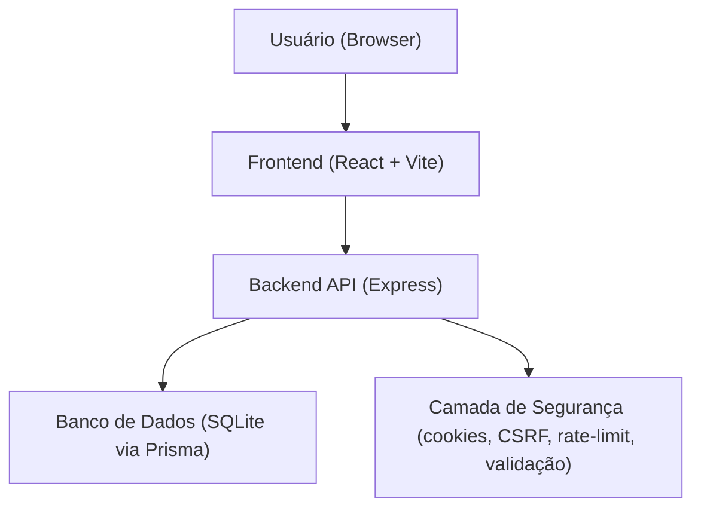
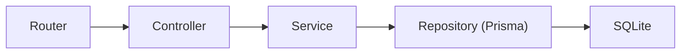
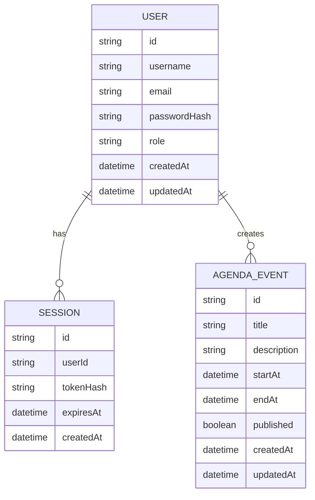

## 1. Desenho de Arquitetura



## 2. Descrição de Tecnologias
- Frontend: React@18 + TypeScript + Vite + TailwindCSS
- Animação do fundo: Canvas 2D (requestAnimationFrame) com interação por mouse
- Backend: Node.js + Express (TypeScript)
- Autenticação: sessões via cookie HttpOnly + armazenamento de sessão no banco (tabela Session)
- Banco de Dados: SQLite (desenvolvimento) via Prisma ORM
- Hardening: helmet, rate limiting, validação com zod, CSRF (double-submit ou csurf), CORS restrito

## 3. Definição de Rotas (Frontend)
| Rota | Objetivo |
|------|----------|
| / | Home com fundo animado, seções do jogo e CTAs |
| /faq | FAQ com busca e accordion |
| /agenda | Agenda pública de eventos |
| /login | Login |
| /registro | Registro |
| /admin | Painel administrativo (apenas "adminstrador") |

## 4. Definições de API (Backend)

### 4.1 Tipos (TypeScript)
```ts
export type PublicUser = {
  id: string;
  username: string;
  emailMasked: string;
  role: "USER" | "ADMIN";
};

export type AgendaEvent = {
  id: string;
  title: string;
  description: string;
  startAt: string;
  endAt: string | null;
  published: boolean;
  createdAt: string;
  updatedAt: string;
};
```

### 4.2 Endpoints
| Método | Endpoint | Autenticação | Descrição |
|--------|----------|--------------|-----------|
| POST | /api/auth/register | Não | Cria conta com email + senha (hash forte) |
| POST | /api/auth/login | Não | Cria sessão e seta cookie HttpOnly |
| POST | /api/auth/logout | Sim | Invalida sessão |
| GET | /api/auth/me | Sim | Retorna dados mínimos do usuário |
| GET | /api/agenda | Não | Lista eventos publicados |
| GET | /api/admin/agenda | Admin | Lista todos eventos (publicados e rascunhos) |
| POST | /api/admin/agenda | Admin | Cria evento |
| PATCH | /api/admin/agenda/:id | Admin | Atualiza evento |
| DELETE | /api/admin/agenda/:id | Admin | Remove evento |
| GET | /api/admin/users | Admin | Lista usuários (campos mínimos) |

## 5. Diagrama de Arquitetura do Servidor


## 6. Modelo de Dados

### 6.1 ER (Mermaid)


### 6.2 DDL (via Prisma)
- O schema será gerado via Prisma e migrado para SQLite.
- O usuário administrador é identificado por username exatamente "adminstrador".
- Bootstrap de admin: na primeira inicialização, se não existir admin, criar com senha vinda de variável de ambiente (ex.: ADMIN_INITIAL_PASSWORD) e exigir troca imediata depois.

## 7. Regras de Segurança (mínimo)
- Senhas: hash forte (bcrypt/argon2), regras de complexidade e comparação em tempo constante
- Cookies: HttpOnly + SameSite + Secure (quando em HTTPS)
- Sessões: token aleatório, armazenar apenas hash do token no banco
- Proteções: rate-limit no login/registro, helmet, validação estrita de input, CORS apenas para o domínio do frontend
- Mensagens: nunca revelar se email/usuário existe; respostas genéricas em falhas
- Admin: autorização por role + username exato "adminstrador"
