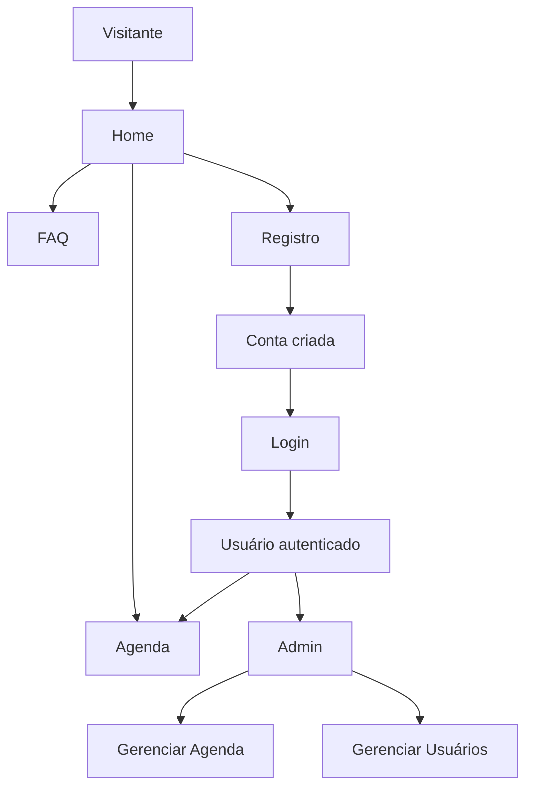

## 1. Visão Geral do Produto
Site oficial focado em um jogo (Prime.gg), com visual moderno e atmosfera “premium gamer”, incluindo fundo animado interativo com o mouse.
- Objetivo: apresentar o jogo, centralizar informações (FAQ), oferecer Agenda de eventos e permitir Registro/Login com área administrativa.
- Valor: experiência profissional + base pronta para crescer com conteúdos e eventos.

## 2. Funcionalidades Principais

### 2.1 Papéis de Usuário
| Papel | Método de Registro | Permissões Principais |
|------|---------------------|------------------------|
| Visitante | Nenhum | Navegar Home/FAQ, ver Agenda pública |
| Usuário | Email + senha | Fazer login, gerenciar itens próprios na Agenda (se habilitado), ver perfil |
| Administrador | Usuário com username exatamente "adminstrador" | Acessar painel /admin, gerenciar usuários, gerenciar Agenda (criar/editar/remover) |

### 2.2 Módulos (por página)
1. **Home**: hero do jogo, destaques, CTA para agenda/registro, fundo animado interativo.
2. **FAQ**: perguntas frequentes com busca e accordion.
3. **Agenda**: lista de eventos (públicos), filtro por data, detalhe do evento.
4. **Registro**: criação de conta (email/senha), validações e mensagens seguras.
5. **Login**: autenticação com cookies seguros, bloqueios anti-abuso.
6. **Admin**: painel exclusivo para "adminstrador" com CRUD de eventos e gestão básica de usuários.

### 2.3 Detalhamento de Páginas
| Página | Módulo | Descrição |
|------|--------|-----------|
| Home | Header + navegação | Logo no canto superior esquerdo (prmgb.png), links para Home/FAQ/Agenda/Login |
| Home | Fundo animado | Grade de “bolinhas” alinhadas que reagem ao mouse com deformação/repulsão suave e efeito de brilho |
| Home | Seções | Destaques do jogo, call-to-actions, cards com micro-interações |
| FAQ | Accordion + busca | Perguntas expansíveis, busca client-side, layout editorial |
| Agenda | Lista + filtros | Lista por data, tags, e visão de detalhes em modal ou página |
| Registro | Formulário | Validação forte, regras de senha, mensagens sem vazamento de existência de usuário |
| Login | Formulário | Rate-limit, lockout progressivo, mensagens genéricas em falha |
| Admin | Acesso restrito | Só usuários com username "adminstrador" autenticado |
| Admin | CRUD Agenda | Criar/editar/remover eventos, marcar como publicado, ordenar destaque |

## 3. Processos Centrais
### 3.1 Fluxos
- Visitante → navega Home/FAQ/Agenda
- Visitante → Registro → Login → Usuário autenticado
- Admin ("adminstrador") → Login → Admin → gerencia Agenda e usuários

## 4. Design da Interface
### 4.1 Estilo
- Tema: escuro “cinema sci-fi” com acentos neon (verde/âmbar) e textura sutil (grão/noise)
- Tipografia: combinação display “tech” + corpo “editorial” (sem cair no visual genérico)
- Componentes: cards com bordas finas, brilho suave, hover com deslocamento/scanline
- Motion: entrada com stagger, fundo animado sempre presente e responsivo ao mouse

### 4.2 Visão Geral de UI
| Página | Módulo | Elementos de UI |
|------|--------|------------------|
| Home | Hero | Título forte, subtítulo, CTAs, grade de destaque, fundo com bolinhas interativas |
| FAQ | Conteúdo | Barra de busca, accordion com animação, âncoras |
| Agenda | Conteúdo | Filtros, cards por data, estado vazio elegante, detalhes claros |
| Login/Registro | Formulários | Campos com feedback, medidor de força de senha (registro), avisos discretos |
| Admin | Painel | Sidebar, tabelas, formulários CRUD, confirmações com segurança |

### 4.3 Responsividade
- Desktop-first com adaptação para mobile
- Canvas/efeito do fundo ajusta densidade/escala conforme viewport e respeita preferências de redução de movimento
